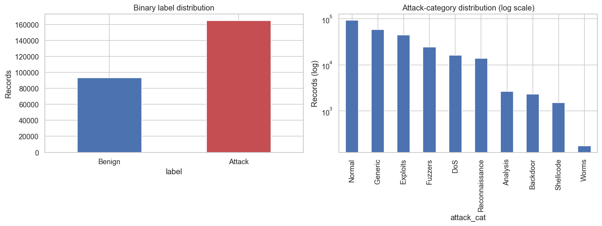
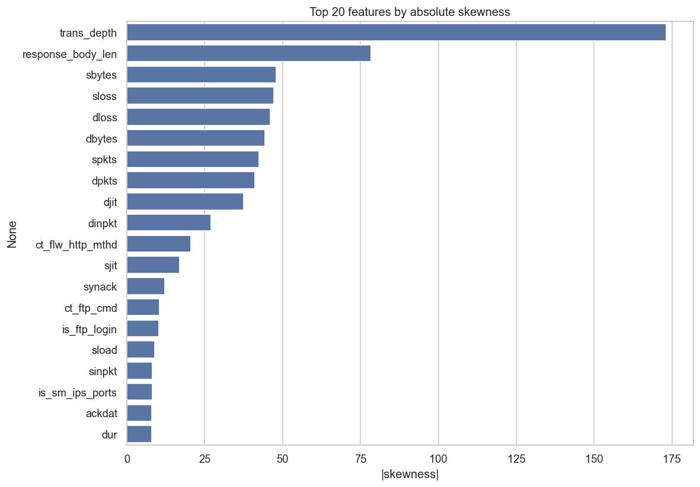
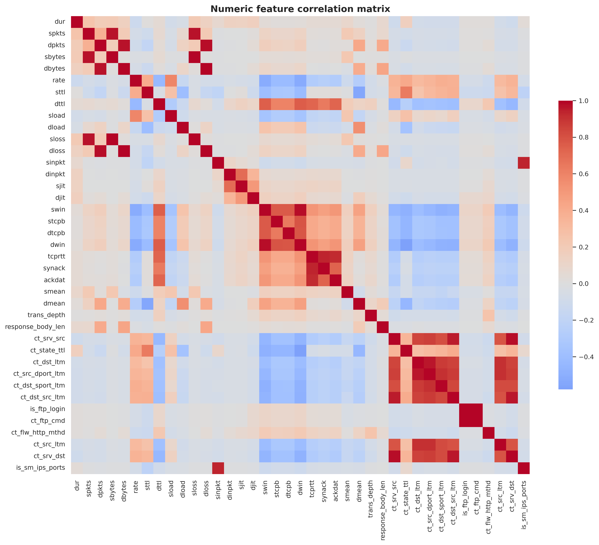
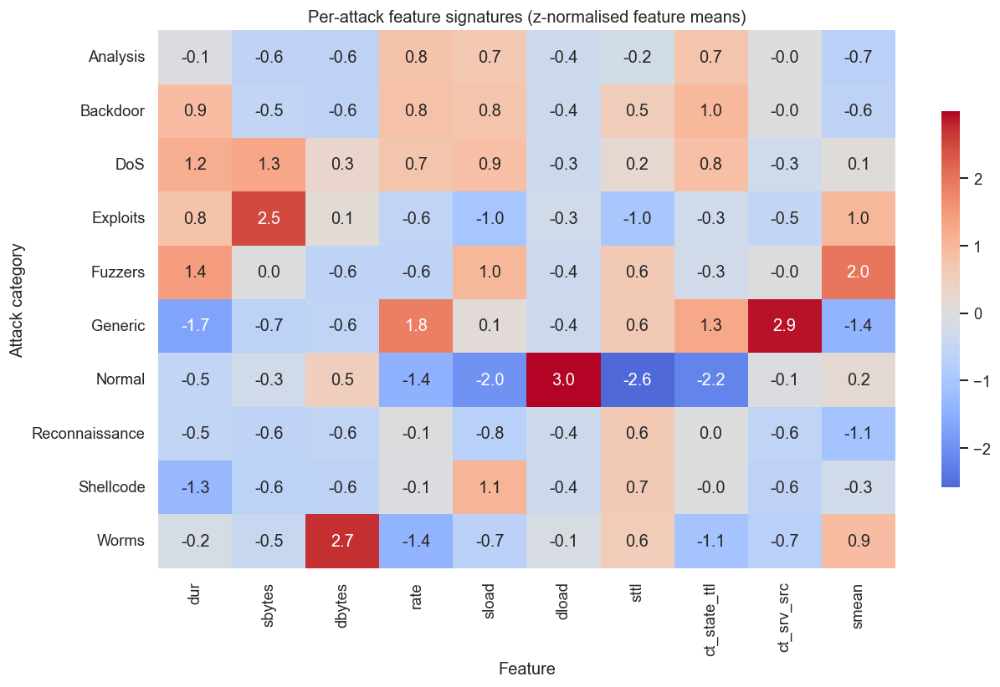
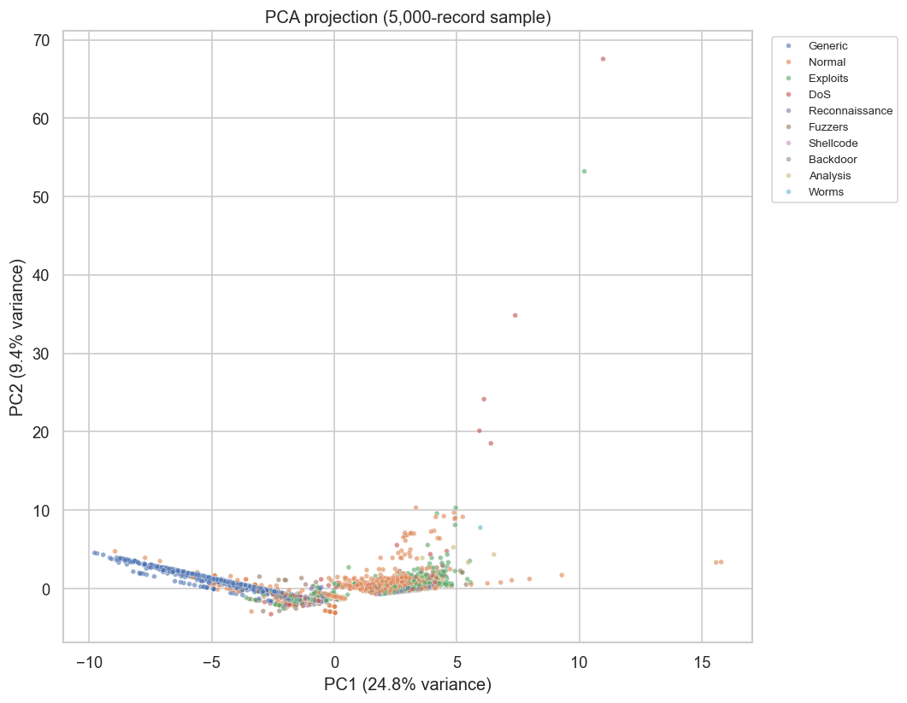
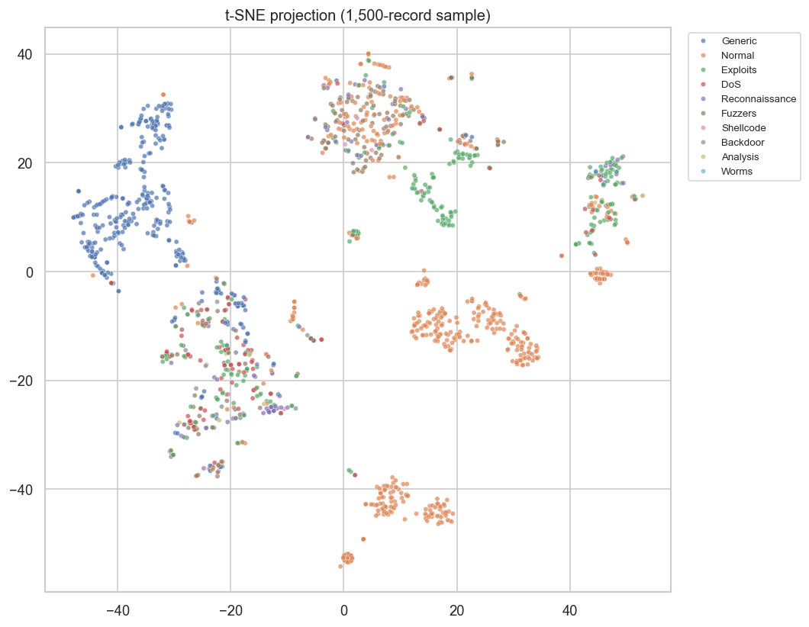
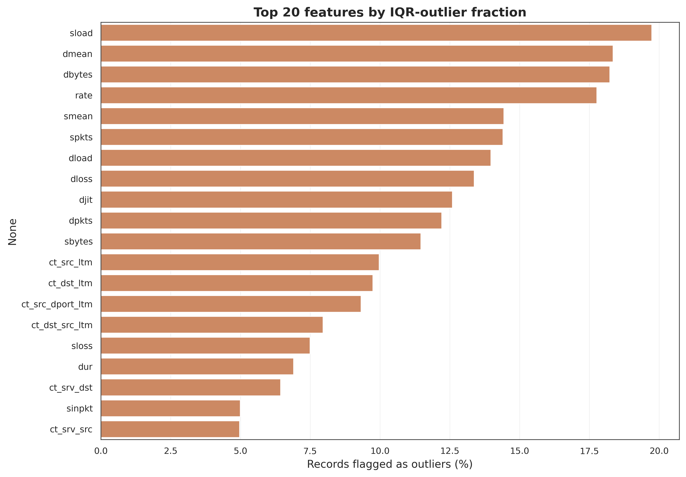
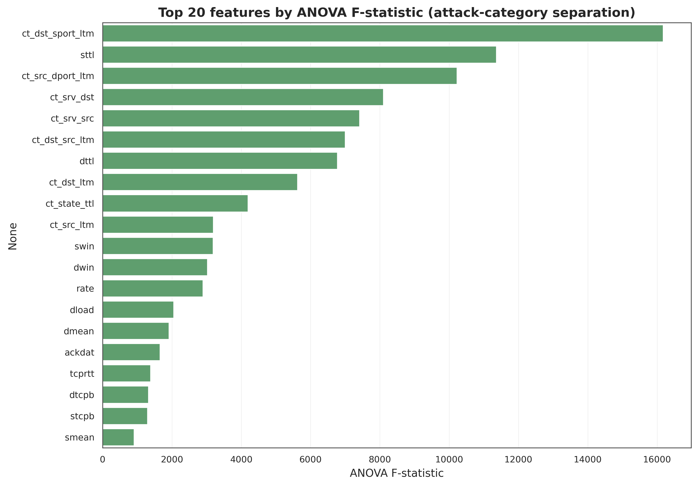

# Exploratory Data Analysis - UNSW-NB15

*Multi-Model IDS project - generated 2026-05-20 by `scripts/run_eda.py`.*

This report is produced automatically from the raw data. It summarises nine analyses that together describe the dataset and motivate the preprocessing, feature-engineering, sampling, and evaluation choices made later in the project.

## 1. Basic information

- **Records:** 257,673
- **Columns:** 45 (39 numeric features, 3 categorical features, 3 identifier/target columns)
- **In-memory size:** 96.7 MB
- **Duplicate records** (identical across every field except the `id` index): 94,928 (36.8%) -- removed during preprocessing to prevent train/test leakage

## 2. Class distribution

Binary labels -- benign: 93,000 (36.1%), attack: 164,673 (63.9%).

Multiclass imbalance ratio (largest / smallest class): **534x**.

| Attack category | Records | Share |
|---|---:|---:|
| Normal | 93,000 | 36.09% |
| Generic | 58,871 | 22.85% |
| Exploits | 44,525 | 17.28% |
| Fuzzers | 24,246 | 9.41% |
| DoS | 16,353 | 6.35% |
| Reconnaissance | 13,987 | 5.43% |
| Analysis | 2,677 | 1.04% |
| Backdoor | 2,329 | 0.90% |
| Shellcode | 1,511 | 0.59% |
| Worms | 174 | 0.07% |

## 3. Missing and invalid values

- Columns containing NaN values: 0
- Infinite values across numeric features: 0
- Placeholder '-' values in categoricals: service=141,321

UNSW-NB15's published partitions are already cleaned; the '-' placeholder in `service` simply means 'no application protocol' and is treated as its own category during preprocessing.

## 4. Feature statistics

Of 39 numeric features, **28** are highly skewed (|skew| > 2). Heavy skew means raw feature scales are very uneven -- this is why neural-network inputs need z-score standardisation while tree models can be left unscaled.

## 5. Feature correlation

**18** feature pairs are highly correlated (|r| > 0.90). Redundant features add cost and noise without adding information -- direct motivation for the feature-selection work in Part 5.

Most-correlated pairs:
  - is_ftp_login ~ ct_ftp_cmd: r = 0.999
  - dbytes ~ dloss: r = 0.997
  - sbytes ~ sloss: r = 0.996
  - swin ~ dwin: r = 0.980
  - dpkts ~ dloss: r = 0.980
  - ct_srv_src ~ ct_srv_dst: r = 0.979
  - dpkts ~ dbytes: r = 0.973
  - spkts ~ sloss: r = 0.972
  - spkts ~ sbytes: r = 0.964
  - ct_dst_ltm ~ ct_src_dport_ltm: r = 0.962

## 6. Attack-category patterns

Each attack category has a distinct 'signature' across key flow features (z-normalised means below). Where two categories share a similar signature, a classifier will tend to confuse them.

## 7. Dimensionality and separability

The first two principal components capture only 34.1% of total variance -- the data is genuinely high-dimensional, so no trivial 2-D rule separates the classes. PCA and t-SNE both show normal traffic and the larger attack types forming visible structure, while the rare classes scatter thinly -- a visual preview of why they are hard to detect.

## 8. Outlier analysis

By the 1.5x-IQR rule, **16** features flag more than 10% of records as outliers. In network traffic these 'outliers' are usually genuine extreme behaviour (bursts, scans), not errors -- so they are kept, but they reinforce the need for robust scaling.

## 9. Statistical tests (ANOVA)

A one-way ANOVA per feature measures how strongly its mean differs across attack categories -- a high F-statistic means the feature separates attack types well.

Most discriminative features: **ct_dst_sport_ltm, ct_srv_dst, ct_src_dport_ltm, ct_srv_src, ct_dst_src_ltm, ct_dst_ltm, ct_src_ltm, sttl**.

## Implications for the project

- **Severe class imbalance** drives the use of stratified sampling, SMOTE / class-weighted loss, and imbalance-aware metrics (macro-F1, PR-AUC, per-class recall) rather than plain accuracy.
- **Heavy feature skew and outliers** mean neural-network inputs must be z-score standardised; tree models can stay unscaled.
- **Highly correlated feature pairs** confirm redundancy and motivate the feature-selection comparison in Part 5.
- **Low 2-D variance and overlapping rare classes** preview RQ2: some attack categories are intrinsically hard to detect.
